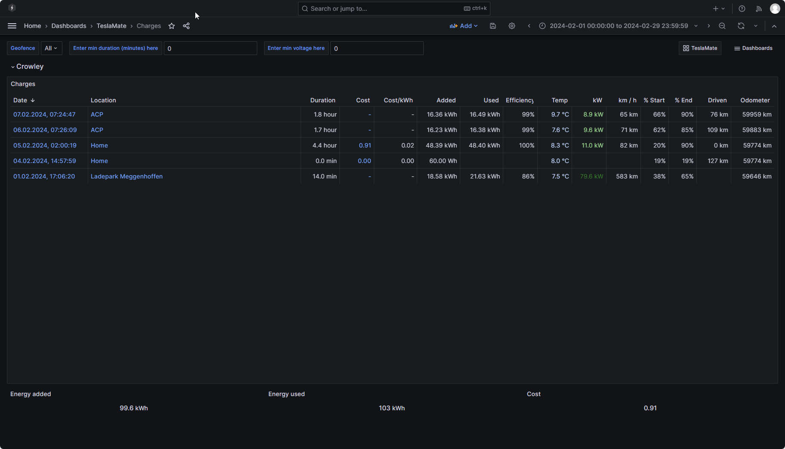
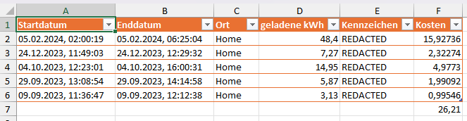

# ACP Ladebericht erstellt

## CSV aus Grafana Exportieren

1) Charges Dashboard öffnen
2) Gewünschten Zeitraum einstellen
3) Gewünschtes Geofance auswählen
4) Im Browser mit i das Inspect Panel öffnen
5) Bei Data Options das DropDown öffnen
6) Formatted data aktivieren
7) Download CSV klicken
8) CSV-Datei im Ordner des Scripts ablegen



## Script ausführen

1) Parameter im File [param.json](param.json) kontrollieren und ggf. anpassen
2) Das Modul für ImportExcel in der Powershell installieren
   ```powershell
   Install-Module ImportExcel
   ```
3) Mit der Powershell in das Verzeichnis des Scripts wechseln
4) Folgenden Code ausführen
    ```powershell
    .\Erstelle-Ladebericht.ps1 -CSVPath '.\CSV-Datei'
    ```
Der Ladebericht liegt nun als Excel im gleichen Ordner wie die CSV-Datei

## Ladebericht

